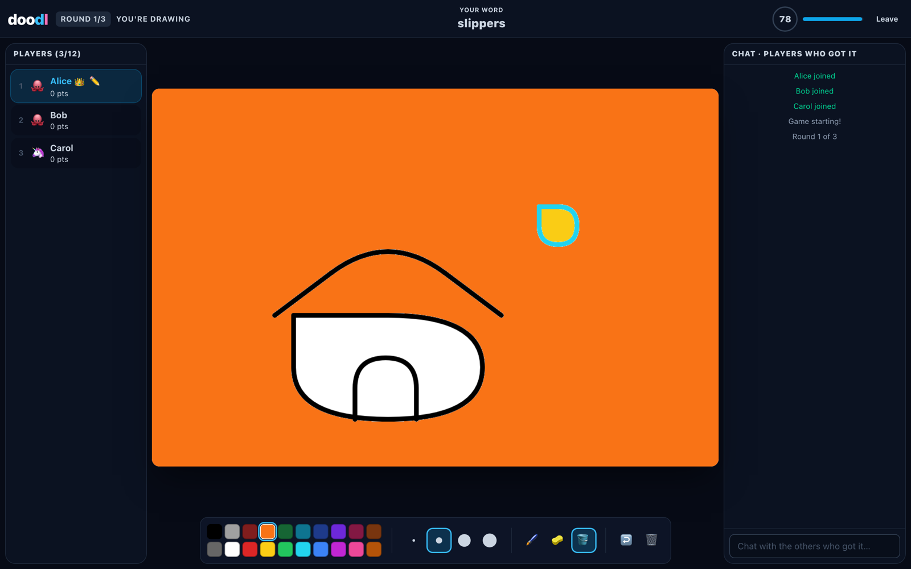
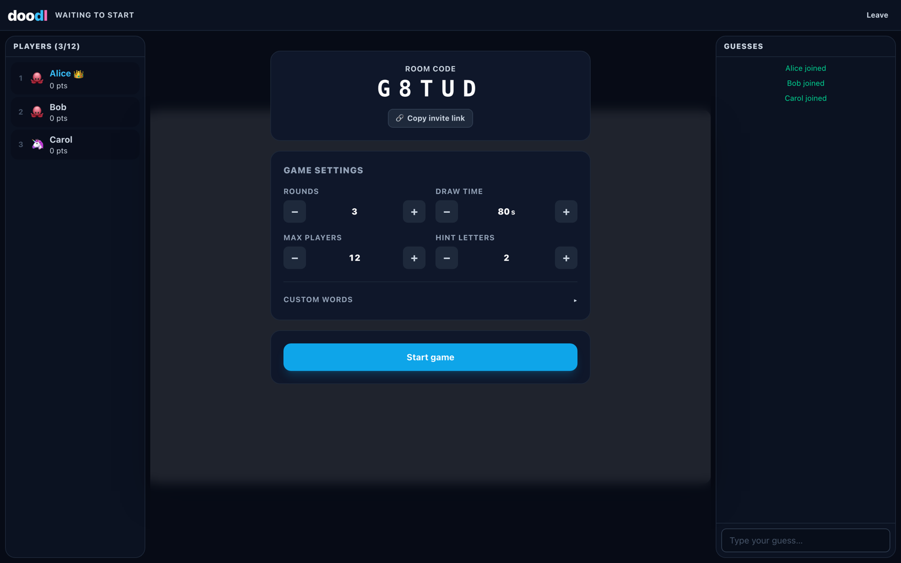

<div align="center">

# doodl

**A free, open source, ad-free multiplayer drawing and guessing game.**

One player draws a secret word, everyone else races to guess it. Self-hostable,
no accounts, no tracking, no ads.



</div>

---

## What it is

doodl is a small, complete drawing-and-guessing game you can run yourself.

- **Rooms by code.** Create a room, share the link, play. No sign-up.
- **Turn-based.** Every player draws once per round, in turn order.
- **Real drawing tools.** Brush with four sizes, twenty colours, eraser, flood
  fill, stroke-level undo, and clear.
- **Progressive hints.** Guessers see the word length and a masked pattern, with
  letters revealed as the clock runs down.
- **Fair scoring.** Guessers score by how fast they got it; the drawer scores by
  how much of the room got it.
- **Custom word lists.** Per-room, a first-class feature — not an afterthought.
- **Works on a phone.** The canvas takes touch properly instead of scrolling the
  page out from under you.
- **Survives a refresh.** Your seat and score are held for a minute, so a dropped
  connection or an accidental reload doesn't end your game.

<div align="center">
  
</div>

## Quick start

Requires **Node 22 or newer**.

```bash
git clone https://github.com/crittermike/doodl.git
cd doodl
npm install
npm run dev
```

That runs the game server on `:8080` and the Vite dev server on `:5173`. Open
<http://localhost:5173> — the dev server proxies `/ws` through to the game
server, so it behaves exactly like production.

To run it the way it actually ships (one process, one port):

```bash
npm run build
npm start          # http://localhost:8080
```

### Commands

| Command | What it does |
| --- | --- |
| `npm run dev` | Game server + Vite dev server with hot reload |
| `npm run build` | Build all three workspaces |
| `npm start` | Serve the built client and the game from one process |
| `npm test` | Unit tests, then the end-to-end socket smoke test |
| `npm run test:unit` | Just the pure-logic unit tests (fast) |
| `npm run test:smoke` | Spawn a server and drive a full game over real sockets |
| `npm run typecheck` | Type-check every workspace |

### Configuration

Copy `.env.example` to `.env`. Everything has a working default; the only knob
most people need is `PORT`.

| Variable | Default | Purpose |
| --- | --- | --- |
| `PORT` | `8080` | Port for the combined HTTP + WebSocket server |
| `CLIENT_DIR` | `../client/dist` | Where the built client lives |
| `ALLOWED_ORIGINS` | *(unset)* | Comma-separated origin allowlist for socket upgrades. Unset allows any, which is correct for a single-origin deploy |
| `DEBUG_WIRE` | `0` | Set to `1` to log every message. Very noisy |

## Self-hosting

### Docker

```bash
docker build -t doodl .
docker run -p 8080:8080 doodl
```

The image is multi-stage: Vite builds the client, `tsc` compiles the server, and
the runtime layer ships only the compiled output plus production dependencies.

### Fly.io

`fly.toml` is included and targets the smallest useful machine.

```bash
fly launch --copy-config --no-deploy   # first time only, to pick an app name
fly deploy
```

The configuration sets `auto_stop_machines = "stop"` and
`min_machines_running = 0`, so an idle doodl costs approximately nothing: the
machine stops when the last player leaves and boots again on the next
connection. That cold start takes a few seconds, which is why the client shows
an explicit **"Waking up the server…"** state rather than looking broken.

A `shared-cpu-1x` machine with **256MB** is genuinely sufficient. Rooms hold
small JSON messages and a few thousand stroke points; the practical ceiling is
concurrent connections, not memory.

### Anywhere else

It's one Node process listening on one port with no external dependencies. If it
can run `node server/dist/index.js` and reach a port, it can host doodl. There is
a `/healthz` endpoint for your load balancer.

## Architecture

```
┌──────────────┐   WebSocket (JSON)   ┌────────────────────────────┐
│   Browser    │◄────────────────────►│   Node server              │
│              │                      │                            │
│  React       │      HTTP (static)   │  Map<roomCode, Room>       │
│   lobby      │◄────────────────────►│    ├─ players, scores      │
│   chat       │                      │    ├─ secret word          │
│   scoreboard │                      │    ├─ ordered op log       │
│   toolbar    │                      │    └─ phase + timers       │
│              │                      │                            │
│  Canvas 2D   │                      │  Static file server        │
│   (outside   │                      │  /healthz                  │
│    React)    │                      │                            │
└──────────────┘                      └────────────────────────────┘
```

Both the client and the WebSocket endpoint are served by the **same process on
the same origin**. That is deliberate: it removes CORS entirely, keeps the
deployment to a single app with no separate static host, and means the socket
URL is always derivable from `location`.

### Layout

```
shared/     wire protocol types + pure logic (guessing, scoring, geometry, words)
server/     Node + ws game server, also serves the built client
client/     Vite + React + Tailwind, with an imperative Canvas 2D engine
```

`shared/` is the single source of truth for the wire protocol. Both other
workspaces import it, so a protocol change that breaks one side fails to compile.

### The server

Node with [`ws`](https://github.com/websockets/ws) — deliberately **not**
Socket.IO. Its framing overhead is meaningful for high-frequency stroke messages,
and the room logic here is custom anyway, so the abstraction earned nothing.

**All state is in memory**, in a single `Map<roomCode, Room>`. There is no
database, no Redis and no persistence layer. Rooms are ephemeral by design: if
the process restarts, in-flight games are lost, and that's an accepted trade for
having nothing to migrate, invalidate or back up.

The server is authoritative for everything that matters. See
[Anti-cheat](#anti-cheat) below.

### Realtime drawing

Strokes are sent as **vectors, never pixels**. The pipeline on the drawer's
machine:

```
pointermove ──► buffer ──► every 50ms ──► thin ──► simplify ──► quantize ──► send
```

1. **Batch, don't stream.** `pointermove` fires at up to 120Hz on a high-refresh
   display. Sending each event floods the socket for no visible gain, so points
   are buffered and flushed on a 50ms interval.
2. **Thin.** Any point within 2px of the last kept point is dropped.
3. **Simplify.** Ramer–Douglas–Peucker removes points that don't change the
   shape. The implementation is iterative, not recursive, so a pathological
   input can't blow the stack.
4. **Quantize.** Coordinates are normalized to 0..1 and stored as 12-bit
   integers. That's ~0.3px of error on a 1200px canvas — invisible — and it
   roughly halves the payload versus floats.
5. **Normalize.** Because coordinates are normalized rather than absolute,
   clients with different window sizes stay in sync; each denormalizes on render.

Consecutive segments of one gesture overlap by two points, so the curve stays
continuous across flush boundaries instead of kinking every 50ms. Rendering uses
**quadratic smoothing** through segment midpoints — without it, a fast stroke
renders as a visible chain of straight lines.

JSON is used on the wire. At a ceiling of 16 players per room the difference
against a packed binary encoding is irrelevant, and being able to read the
traffic in devtools is worth far more than the bytes.

**The server retains the current round's ordered op log**, so anyone who joins
late or reconnects gets a full replay instead of a blank canvas.

**Flood fill** broadcasts only the origin point and the colour; every client runs
the fill itself. The canvas backing store is a fixed 1200×800 on every client
(CSS-scaled to fit), so all clients rasterize identical pixel geometry. Results
still aren't bit-identical, because Canvas 2D gives no way to disable stroke
antialiasing and a soft edge can differ by a shade between browsers — a
tolerance-based fill absorbs nearly all of it. skribbl.io has the same artifact;
it's inherent to filling on the client rather than shipping pixels.

### The client

Vite + React + TypeScript + Tailwind.

**React does not render the drawing.** The canvas is owned by a `DrawingEngine`
class that lives entirely outside React's render loop and is driven through
refs. Pointer events never touch React state, and remote draw messages are
routed from the socket straight into the engine. React renders the lobby, chat,
scoreboard and toolbar, and nothing else. A player scribbling furiously produces
zero React renders anywhere in the tree.

The socket reconnects with jittered exponential backoff and reclaims the
player's seat with a token issued at join. Jitter matters: without it, every
client in a room retries in lockstep after a server restart.

## Anti-cheat

A drawing game leaks its answer very easily. These rules are enforced
**server-side**, and the end-to-end smoke test exists mainly to keep them
enforced:

- **The word is only ever sent to the drawer.** Guessers receive the word length
  and a masked pattern (`_ _ _ _`). Word *choices* likewise go only to the
  drawer.
- **Guess matching happens on the server**, over text normalized for case,
  diacritics, punctuation and whitespace — so `ICE CREAM`, `ice-cream` and
  `icecream` all match, and the client never gets the material to check locally.
- **A correct guess is never echoed to chat.** Broadcasting the raw message
  would hand the answer to every player still guessing. A system message —
  *"Alice guessed the word!"* — goes out instead.
- **A near miss gets a private nudge.** A guess one edit away triggers
  *"You're close!"*, sent to that player alone. It's deliberately limited to
  words of four letters or more; below that, one edit is most of the word.
- **Every draw, undo and clear event is checked against the current drawer.**
  Otherwise any connected client could scribble on the canvas at any time.
- **Players who already know the word are moved to a private channel.** The
  drawer and anyone who has guessed correctly can only talk to each other, so
  they can't tip off the players still guessing.

Beyond that: every inbound field is validated before it reaches game logic,
chat/draw/action messages are token-bucket rate limited per connection, names are
stripped of control and bidi characters, and the static file server refuses path
traversal.

## Word list

The built-in list is **original to this project** — roughly 600 common, drawable
English nouns written by hand for doodl. It is not copied from or derived from
skribbl.io or any other game's word list.

Rooms can supply their own list in the lobby, either mixed in with the built-in
words or used exclusively.

## Scaling out

A room lives in one process's heap, so **a room is sticky to the machine that
created it**. Running more than one machine requires routing every connection
for a given room code back to the machine that owns it. On Fly that means
replying to the upgrade request with a
[`fly-replay`](https://fly.io/docs/networking/dynamic-request-routing/) header
keyed on the room code.

That is not implemented, and room state is deliberately **not** shared between
machines. A single 256MB machine handles far more concurrent games than a
self-hosted instance is likely to see.

## Testing

```bash
npm test
```

Two layers, both deliberately narrow:

- **Unit tests** (`shared/test/`) cover the pure logic most likely to break:
  guess normalization and matching, Levenshtein distance, scoring maths, and
  stroke thinning/simplification.
- **A smoke test** (`server/test/smoke.mjs`) spawns a real server and drives
  several clients through a complete game over real WebSockets. It exists mostly
  to guard the anti-cheat rules — those fail *silently*, and a unit test can't
  see what actually went out on the wire.

## Contributing

Issues and pull requests are welcome. `npm run typecheck && npm test` should pass
before you open one.

## License

MIT. See [LICENSE](LICENSE).
